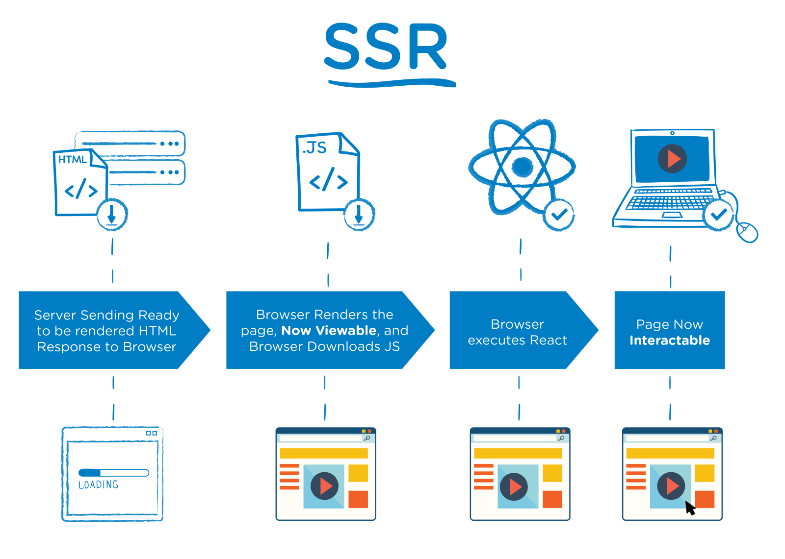

# Server Side Rendering in React

---

## Client Side Rendering

* Browser makes a request to the server
* Server reponds with HTML that contains links to CSS and JS that needs to be downloaded
* Browser downloads CSS and JS
* Javascript (React) is parsed and executed

Notes:

This means that the user will have to wait longer for the initial render.

This also means that crawlers may interpret your page as empty.

---


---

## Server Side Rendering

* Browser makes a request to the server
* Server renders React app to static HTML and CSS
* Browser renders HTML/CSS and downloads JS
* Javascript (React) is parsed and executed

Notes:

SSR is the process of taking a client side Javascript framework website and rendering it to static HTML and CSS on the server.

So the idea is to render your app on the server initially, then allow React to hook into the page on the client and take over control.

Now the user does not have to wait for the JS to load and gets a fully rendered HTML as soon as the initial response from the server.

---



Notes:

For SSR your server’s response to the browser is the HTML of your page that is ready to be rendered,
while for CSR the browser gets a pretty empty document with links to your javascript

---

## Why Server Side Rendering?

* Fully indexable HTML pages
* Faster times for the initial page render

Notes:

With CSR, the initial response from the server is typically a blank page, causing SEO crawlers to interpret it as just that

---

## Why Not Server Side Rendering?

* Can degrade performance
* Increases the complexity of the application

Notes:

Can degarde performance if application is heavy

* increases response time (and it can be worse if the server is busy)
* increases response size, which means the page takes longer to load

Global objects that only exist in the browser (window, etc.) will not be available on the server
and must be handled accordingly

Certain React lifecycle hooks that don't get called on the server. Only `componentWillMount` will be called on the server

You need to use something like babel or webpack to be able to compile JSX on the server

* babel is faster to run on the server but cannot handle importing css so it must be told to ignore css

Some React 16 features are not supported on the server

* Error Boundaries or Portals

---

## How Does It Work

```javascript
// server.js
import ReactDOMServer from "react-dom/server";

const app = <App {...props} />;

ReactDOMServer.renderToString(app);
```

```js
// client.js
import React from "react";
import ReactDOM from "react-dom";

const props = window.__STATE__;
const domNode = document.querySelector("#app");
const app = <App {...props} />;

hydrate(app, domNode);
```

Notes:

#### `ReactDOMServer.renderToString(element)`

Render a React element to its initial HTML. React will return an HTML string. You can use this method to generate HTML on the server and send the markup down on the initial request for faster page loads and to allow search engines to crawl your pages for SEO purposes.

If you call `ReactDOM.hydrate()` on a node that already has this server-rendered markup, React will preserve it and only attach event handlers, allowing you to have a very performant first-load experience.

#### `ReactDOMServer.renderToStaticMarkup(element)`

Similar to renderToString, except this doesn’t create extra DOM attributes that React uses internally, such as data-reactroot. This is useful if you want to use React as a simple static page generator, as stripping away the extra attributes can save some bytes.

If you plan to use React on the client to make the markup interactive, do not use this method. Instead, use renderToString on the server and ReactDOM.hydrate() on the client.

#### Client

Use window object to store initial application state data

* state content must be serializable to be put on the window

---

## Render vs Hydrate

```javascript
// use when rendering ONLY on the client
ReactDOM.render(element, container[, callback])
```

```javascript
// use to hook into components rendered on the server
ReactDOM.hydrate(element, container[, callback])
```

Notes:

#### `render`

Render a React element into the DOM in the supplied container and return a reference to the component (or returns null for stateless components).

If the React element was previously rendered into container, this will perform an update on it and only mutate the DOM as necessary to reflect the latest React element.

#### `hydrate`

Same as `render()`, but is used to hydrate a container whose HTML contents were rendered by `ReactDOMServer`.
React will attempt to attach event listeners to the existing markup.

React expects that the rendered content is identical between the server and the client.
It can patch up differences in text content, but you should treat mismatches as bugs and fix them.
In development mode, React warns about mismatches during hydration.

---

## References

* https://reactjs.org/docs/react-dom.html
* https://reactjs.org/docs/react-dom-server.html
* https://medium.freecodecamp.org/server-side-rendering-your-react-app-in-three-simple-steps-7a82b95db82e
* https://medium.freecodecamp.org/demystifying-reacts-server-side-render-de335d408fe4
