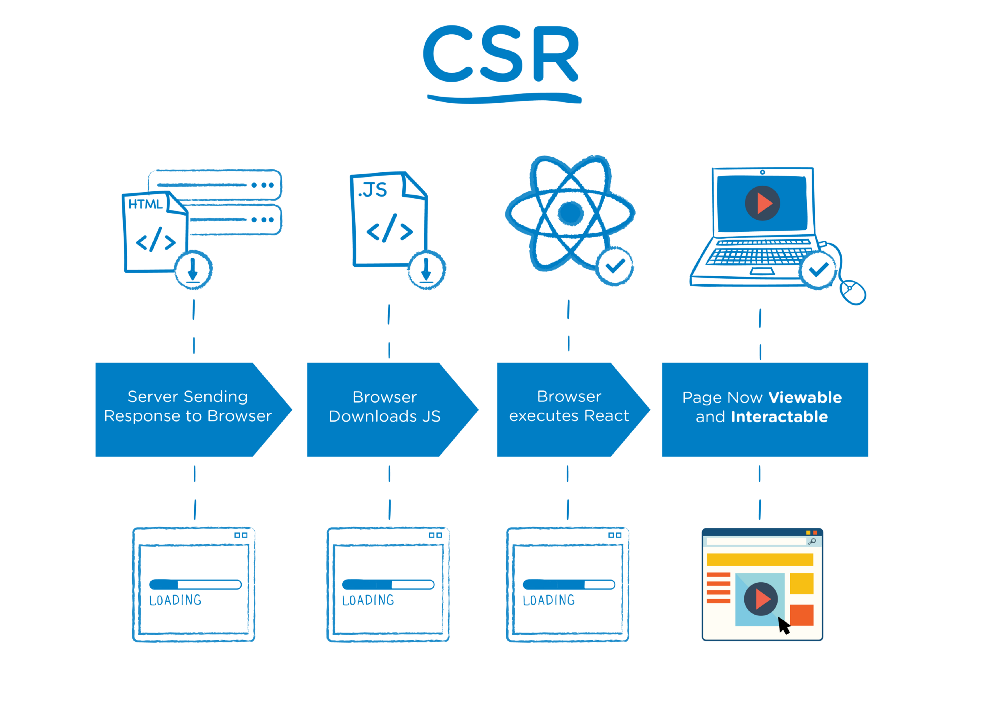

# Server Side Rendering in React

---

## What is Server Side Rendering (SSR)

Notes:

SSR is the ability of a front-end framework to render markup while running on a back-end system.

The initial server request generally returns an empty HTML file with CSS and JavaScript (JS) links
that need to be fetched in order to render relevant markup.

This means that the user will have to wait longer for the initial render. This also means that crawlers may interpret your page as empty.

So the idea is to render your app on the server initially, then to leverage the capabilities of SPAs on the client.

Now the user does not have to wait for the JS to load and gets a fully rendered HTML as soon as the initial response from the server.

---

## What’s the difference between client-side rendering and server-side rendering?

Notes:

* In Client-side rendering, your browser downloads a minimal HTML page. It renders the JavaScript and fills the content into it.
* Server-side rendering, on the other hand, renders the React components on the server. The output is HTML content.
* You can combine these two to create an isomorphic app.

---

## How it works

---

Notes:

For SSR your server’s response to the browser is the HTML of your page that is ready to be rendered,
while for CSR the browser gets a pretty empty document with links to your javascript

---

---

## When should you use Server Side Rendering?

----

### SEO

* Search engine crawlers do not yet understand/render JavaScript.

----

### Improve performance

* application performance depends on the server’s resources and user’s network speed. This makes it very useful for content-heavy sites.
* First User Interaction Time. This is the difference in time from when a user hits the URL to when they see content.

Notes:

* First User Interaction Time: This is the difference in time from when a user hits the URL to when they see content.

---

## Cons of Rendering React on the Server

* improve performance if your application is small. But it can also degrade performance if it is heavy
* increases response time (and it can be worse if the server is busy)
* increases response size, which means the page takes longer to load
* increases the complexity of the application

---

## References

* https://medium.freecodecamp.org/server-side-rendering-your-react-app-in-three-simple-steps-7a82b95db82e
* https://medium.freecodecamp.org/demystifying-reacts-server-side-render-de335d408fe4
